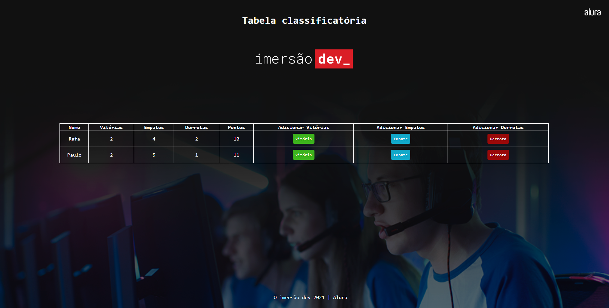

# Tabela de Classificação de Jogos 

## Descrição do Projeto 💻

Tabela para contagem de pontos em um jogo. O programa calcula a quantidade de vitórias, empates, derrotas e total de pontos dos jogadores. 
Exercício prático desenvolvido como parte integrante do curso Imersão Dev | Alura.
Instrutores: Rafaella Ballerini, Guilherme Lima e Paulo Silveira.
Veja o conteúdo da aula no YouTube:

[Clique aqui](https://www.youtube.com/watch?v=nd_NPZxBf9w&t=313s).

### Status do Projeto 

Em desenvolvimento :warning:

### Começando 🏁

Para conseguir utilizar o template basta fazer o download do projeto ou clonar este repositório utilizando o Git em seu terminal.

### Observações 📌

No template temos a lógica criada e os campos definidos, mas sinta-se a vontade para fazer alterações.

### Pré-requisitos :large_orange_diamond: 

Editor de texto de sua preferência, neste projeto foi utilizado o [VSCode](https://code.visualstudio.com).

### Tecnologias 🛠

As seguintes ferramentas foram usadas na construção do projeto:

- [JavaScript](https://developer.mozilla.org/pt-BR/docs/Web/JavaScript)
- [HTML](https://developer.mozilla.org/pt-BR/docs/Web/HTML)
- [CSS](https://developer.mozilla.org/pt-BR/docs/Web/CSS)

### Criado por:

Feito com ❤️ por Francislene Oliveira 👋🏽 Entre em contato!
 

### Licença

 